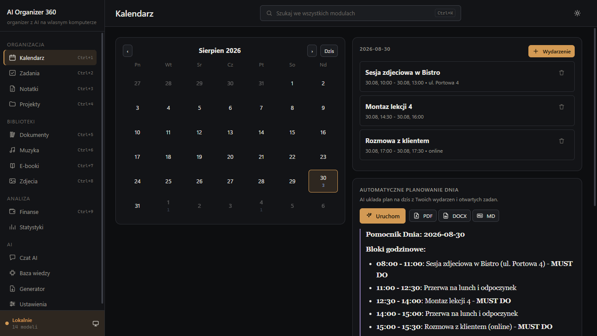

# AI Organizer 360

[](https://apps.microsoft.com/detail/9NP4HNDX4VVZ)
[](https://github.com/zetmar-collab/ai-organizer-360/releases/latest)
[](test)

**Aplikacja jest dostepna w Microsoft Store: https://apps.microsoft.com/detail/9NP4HNDX4VVZ**

Lokalna aplikacja desktopowa dla Windows: organizer (kalendarz, zadania, notatki, projekty, biblioteki plikow,
finanse, statystyki) z wbudowanym czatem AI, baza wiedzy RAG i generatorem dokumentow.

Dwa silniki AI, przelaczane jednym kliknieciem:

- **Ollama** - model uruchamiany lokalnie, zadne dane nie opuszczaja komputera,
- **OpenRouter** - modele w chmurze, wlasny klucz API (szyfrowany Windows DPAPI).

Wszystkie dane sa trzymane lokalnie w jednym pliku SQLite - bez konta, bez abonamentu, bez chmury.



## Instalacja

**Zalecane - Microsoft Store:** https://apps.microsoft.com/detail/9NP4HNDX4VVZ
Aktualizacje przychodza automatycznie, pakiet jest podpisany przez Microsoft, instalacja jednym kliknieciem.

**Alternatywnie - pliki .exe** z [ostatniego wydania](https://github.com/zetmar-collab/ai-organizer-360/releases/latest):

| Plik | Opis |
| --- | --- |
| `AI-Organizer-360-1.2.0-x64.exe` | instalator (NSIS, wybor katalogu, skrot na pulpicie) |
| `AI-Organizer-360-1.2.0-portable.exe` | wersja przenosna, uruchamiana bez instalacji |

Pliki .exe nie sa podpisane certyfikatem, wiec SmartScreen pokaze ostrzezenie - "Wiecej informacji" -> "Uruchom mimo to".
Wersja ze Store tego problemu nie ma.

Uwaga: wydanie ze Store i wydanie instalowane z pliku maja **osobne bazy danych**. Dane przenosi sie
miedzy nimi przez Ustawienia -> Kopia zapasowa.

## Wersja dla Microsoft Store (MSIX)

| Skrypt | Wynik | Podpis |
| --- | --- | --- |
| `npm run dist:store` | `release/AI-Organizer-360-<wersja>-store.appx` | **brak** - pakiet podpisuje Partner Center |
| `npm run dist:msix-test` | `release/AI-Organizer-360-<wersja>-test-signed.appx` | certyfikat testowy z magazynu Windows |

Tozsamosc pakietu (z Partner Center):

```
Identity/Name            MarekZettel-zetmar.AIOrganizer360
Identity/Publisher       CN=15A53D32-C868-48EE-B700-5DBB5449CA1B
PublisherDisplayName     Marek Zettel - zetmar
Package Family Name      MarekZettel-zetmar.AIOrganizer360_411qrz2m02jw4
```

Instalacja wersji testowej i jej usuniecie:

```bash
Add-AppxPackage -Path release\AI-Organizer-360-1.2.0-test-signed.appx
```

```bash
Get-AppxPackage -Name MarekZettel-zetmar.AIOrganizer360 | Remove-AppxPackage
```

Uwagi:

- Podpisywanie MSIX robi `tools/sign-msix.cjs`, bo signtool dolaczony do electron-buildera jest
  za stary i konczy sie bledem "A required function is not present". Skrypt siega po signtool.exe
  z Windows SDK i podpisuje certyfikatem o podanym odcisku.
- Manifest deklaruje `runFullTrust` - to wymog kazdej aplikacji Win32 w Store i przy zgloszeniu
  trzeba o te mozliwosc poprosic w Partner Center.
- Kazde kolejne zgloszenie wymaga wyzszego numeru wersji w `package.json`.
- Ikony i kafelki powstaja skryptem `tools/make-icons.cjs` (renderuje znak w Electronie i sklada
  wielorozmiarowy `.ico`) - nie ma zadnej zaleznosci od bibliotek graficznych.

## Moduly

| Modul | Co robi |
| --- | --- |
| Kalendarz | siatka miesiaca, wydarzenia, powiazanie z projektem, **automatyczne planowanie dnia (AI)** |
| Zadania | priorytety, terminy, projekty, szybkie dodawanie, **inteligentne przypomnienia (AI)** |
| Notatki | edytor Markdown z podgladem, tagi, **podsumowania (AI)**, wysylka do bazy wiedzy |
| Projekty | status, postep zadan, kolor, licznik notatek |
| Dokumenty / E-booki / Zdjecia | skanowanie folderow, wyszukiwanie, **automatyczna kategoryzacja plikow (AI)** |
| Audiobooki | **jeden katalog = jedna ksiazka** (nawet gdy zawiera kilkadziesiat mp3), dodawanie wielu podkatalogow naraz oraz pojedynczych plikow (.m4b), tytul/autor/kategoria do edycji |
| Muzyka | to samo co wyzej plus **widok katalogow** (grupowanie tak, jak muzyka lezy na dysku) i **tworzenie playlist** w formatach M3U8, M3U, PLS, XSPF i WPL |
| Finanse | przychody i wydatki, kategorie, bilans miesieczny |
| Statystyki | KPI, wykresy 30-dniowe, **analiza produktywnosci (AI)** |
| Czat AI | streaming odpowiedzi, historia rozmow, tryb **rozmowy z wlasnymi dokumentami (RAG)** |
| Baza wiedzy | budowana **wylacznie z plikow dodanych w tym module** i notatek wyslanych recznie; zapis na stale, zaznaczanie i usuwanie wybranych dokumentow, **wyszukiwanie semantyczne** |
| Generator | dokumenty, teksty i e-maile, opcjonalnie na bazie wlasnych dokumentow |
| Eksport | PDF, DOCX, Markdown - z kazdego wyniku AI i z notatek |
| Wyszukiwanie globalne | **Ctrl+K** - jedno pole przeszukuje zadania, notatki, wydarzenia, projekty, pliki i finanse, a rownolegle semantycznie baze wiedzy; Enter przenosi prosto do znalezionego rekordu |

## Pierwsze uruchomienie

1. Zainstaluj [Ollame](https://ollama.com) i pobierz modele:
   ```bash
   ollama pull llama3.2:3b
   ```
   ```bash
   ollama pull nomic-embed-text
   ```
2. Uruchom aplikacje - domyslnie dziala w trybie lokalnym (Ollama, `http://localhost:11434`,
   model `llama3.2:3b`). Kazdy inny pobrany model wybierzesz w Ustawieniach z listy.
3. Opcjonalnie: **Ustawienia -> OpenRouter** -> wklej klucz API, zeby korzystac z modeli w chmurze.

`nomic-embed-text` jest uzywany do bazy wiedzy - modele czatowe zwykle nie obsluguja embeddingow
(serwer zwraca wtedy HTTP 501). Kolejnosc awaryjna: model embeddingow -> model czatu -> tryb leksykalny
offline, ktory dziala zawsze, ale mniej trafnie niz embeddingi semantyczne.

## Praca ze zrodlami

```bash
npm install
```

```bash
npm run dev
```

```bash
npm test
```

```bash
npm run dist
```

`npm run dist` buduje bundle i pakuje oba pliki `.exe` do `release/`.
`npm test` uruchamia testy jednostkowe (Vitest, bez Electrona) - pokrywaja chunking tekstu,
renderowanie Markdown (granica XSS), budowanie zapytan SQL z whitelista kolumn oraz embeddingi leksykalne.

## Architektura

```
src/
  main/            proces glowny Electrona (Node)
    db.ts          SQLite (node-sqlite3-wasm) + generyczne CRUD z whitelista kolumn
    settings.ts    ustawienia; klucz API szyfrowany przez safeStorage (DPAPI)
    ai/
      provider.ts  wspolny interfejs LLMProvider - zaden modul nie wola API bezposrednio
      ollama.ts    /api/chat (NDJSON streaming), /api/embed
      openrouter.ts /chat/completions (SSE streaming)
      embeddings.ts embeddingi + awaryjny tryb leksykalny
      tasks.ts     funkcje AI korzystajace z danych z bazy
    rag.ts         indeksowanie, wyszukiwanie kosinusowe, raport pokrycia
    search.ts      wyszukiwanie globalne przez wszystkie moduly
    query.ts       czysty builder zapytan SELECT (whitelista kolumn)
    extract.ts     ekstrakcja tekstu z PDF (pdfjs), DOCX (mammoth), plikow tekstowych
    library.ts     skanowanie folderow z plikami
    exporter.ts    eksport PDF (printToPDF), DOCX (docx), Markdown
    playlist.ts    zapis playlist muzycznych (M3U8/M3U/PLS/XSPF/WPL)
    audiobooks.ts  audiobooki: katalog jako jedna ksiazka albo pojedynczy plik
    paths.ts       tlumaczenie wirtualnej sciezki MSIX na fizyczna dla Eksploratora
    ipc.ts         wszystkie kanaly IPC
  preload/         kontekstowo izolowany most (contextBridge)
  renderer/        interfejs React
  shared/          typy, parser Markdown, chunking i wektory - wspoldzielone
                   miedzy procesami i pokryte testami
test/            testy jednostkowe (Vitest) + harness RAG do testu recznego
```

### Playlisty

W module Muzyka utwory sa grupowane po katalogu, w ktorym leza na dysku. Zaznaczasz cale katalogi
albo pojedyncze utwory i zapisujesz playliste w wybranym formacie:

| Format | Uwagi |
| --- | --- |
| M3U8 | domyslny, UTF-8 - polskie znaki bezpieczne (VLC, foobar2000, Winamp) |
| M3U | starszy wariant tej samej struktury |
| PLS | Winamp i odtwarzacze sieciowe |
| XSPF | otwarty format XML, natywny dla VLC |
| WPL | Windows Media Player |

Opcja "sciezki wzgledne" liczy sciezki od katalogu, w ktorym zapisujesz playliste - dzieki temu
playlista lezaca przy muzyce dziala po przeniesieniu na inny dysk. Pliki spoza tego katalogu
zostaja zapisane sciezka bezwzgledna. Dlugosc utworow zapisujemy jako -1 (nieznana), bo aplikacja
nie czyta metadanych audio.

Bezpieczenstwo: `contextIsolation: true`, `nodeIntegration: false`, CSP w `index.html`, linki zewnetrzne
otwierane w przegladarce systemowej, zapisy do bazy przez whiteliste kolumn.

## Gdzie sa dane

```
%APPDATA%\ai-organizer-360\data\organizer.db
```

Kopia zapasowa = skopiowanie tego pliku. Aplikacja nie wysyla nigdzie danych w trybie Ollama.
W trybie OpenRouter do API trafiaja tresc zapytania i - przy wlaczonym RAG - fragmenty dokumentow.
